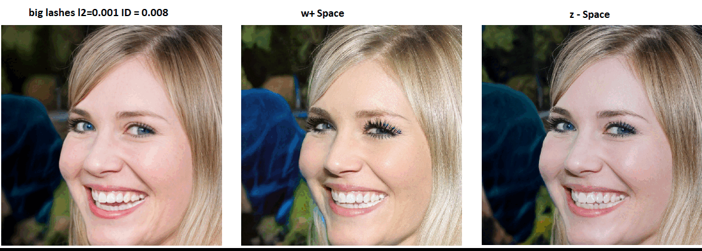

# Image_Editing_StyleCLIP_Optimization

Text-Based Image Editing via Optimization Playground: 

## Description
This repository contains my reimplementation of an optimization approach to editing images as proposed in [this artickle.](https://arxiv.org/abs/2103.17249). The general idea is to find within the style space W+ of 18x512 dimensions the style vector that will generate the desired image, which is described by a text prompt. To achieve the text-based manipulation, a special loss function is used, which includes two neural networks: [CLIP](https://github.com/openai/CLIP) and [ArcFace.](https://arxiv.org/abs/1801.07698), In particular, we utilize [this](https://medium.com/@ichigo.v.gen12/arcface-architecture-and-practical-example-how-to-calculate-the-face-similarity-between-images-183896a35957) implementation of ArcFace .
As inverting StyleGAN is quite a challenging problem and computationally heavy, for learning purposes, the images generated by [StyleGAN](https://github.com/NVlabs/stylegan2-ada-pytorch) itself is used for test images.

## Useful Links and Artickles
*StyleGAN inverters:* [1](https://github.com/pender/stylegan-encoder), [2](https://github.com/omertov/encoder4editing)  
*StyleGAN architecture:* [1](https://arxiv.org/abs/1812.04948)  
*Improving the Image Quality of StyleGAN:* [1](https://arxiv.org/abs/1912.04958)  
*Designing an Encoder for StyleGAN Image Manipulation:* [1](https://arxiv.org/abs/2102.02766) 

