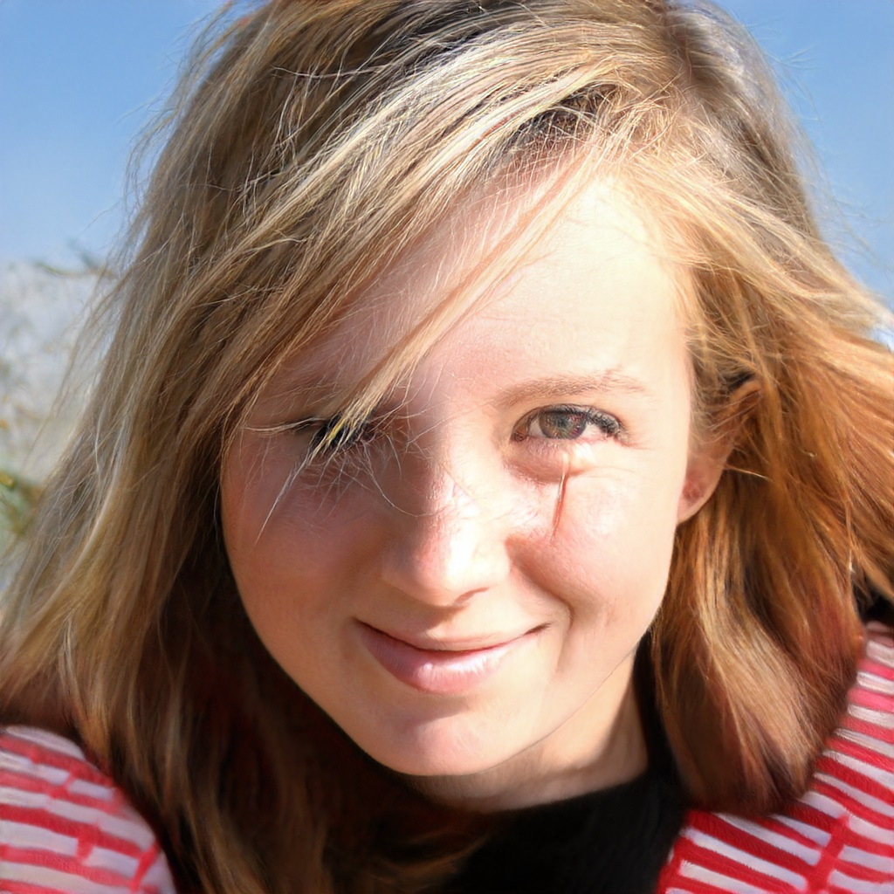

# Image_Editing_StyleCLIP_Optimization

Text Based Image Editing via Optimization: 

## Description
This repository is my reimplementation of optimization approach to editing images proposed in [this artickle.](https://arxiv.org/abs/2103.17249). The general idea is to find in the style space w+ of 18*512 dimensions the style vector wich will generate the desired image which is described by a text promt. To achieve such text based manipulation the special  loss function is used which includes two neural networks [CLIP](https://github.com/openai/CLIP) and [ArcFace.](https://arxiv.org/abs/1801.07698), [partivulary this implementation of ArcFace is used.](https://medium.com/@ichigo.v.gen12/arcface-architecture-and-practical-example-how-to-calculate-the-face-similarity-between-images-183896a35957)
As inverting StyleGAN is quite a challenging problem and computationally heavy, for the learning purpuses the images generated by [StyleGAN](https://github.com/NVlabs/stylegan2-ada-pytorch) is used for editing.

## Useful Links and Artickles
**StyleGAN inverters:**[1](https://github.com/pender/stylegan-encoder), [2](https://github.com/omertov/encoder4editing)  
**StyleGAN architecture** [1](https://arxiv.org/abs/1812.04948)  
**Improving the Image Quality of StyleGAN** [1](https://arxiv.org/abs/1912.04958)  
**Designing an Encoder for StyleGAN Image Manipulation** [1](https://arxiv.org/abs/2102.02766) 

